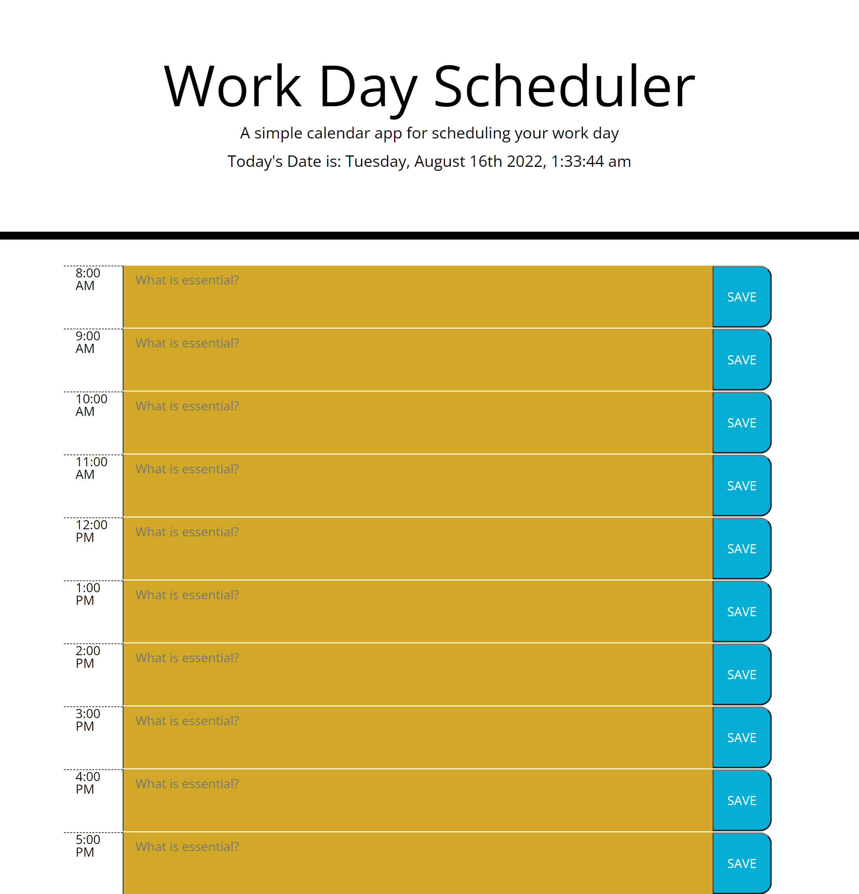

# Work-schedule

A Planner for one's work schedule

## Description

```
This is a planner to help one manage time more effectively through the work day. Using Moment the time is tracked by the hour, displaying a green background on the current hour, a grey background on past events and a gold background on future.
```

## Meeting the Clients Needs

```
* I created a clear layout that displays on the page and allows the client to save tasks into each time block.

* I learned how complex using a single third-party api can be, and the importance of commenting as you code.
```

## Screenshot



You can find the deployed webpage here:[Work-schedule](https://cucius.github.io/Work-schedule/)
